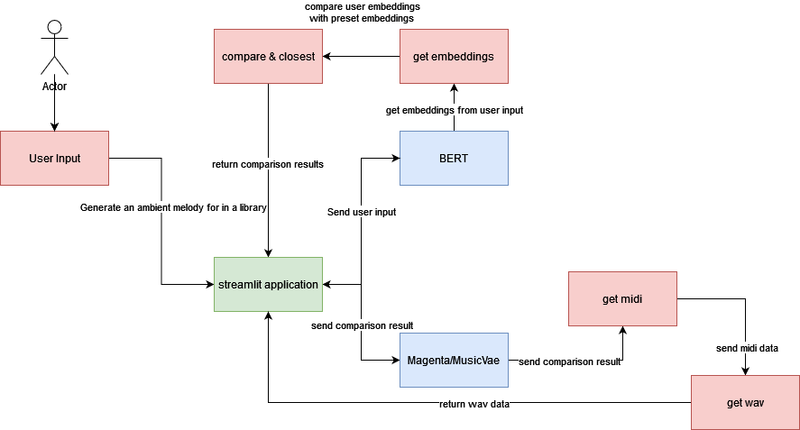

# NLPMusicGenerator
### Design a streamlit application to enable a user to use language to generate a melody with a specific description.

For this application I used the [Magenta](https://magenta.tensorflow.org/) library to generate music. I used the [Music_Vae](https://magenta.tensorflow.org/music-vae) model to generate music.
For the NLP part of the exercise I used BERT to generate embeddings for the text input and then used cosine similarity to find the closest match to the input text from a set of pre-defined descriptions.

### How does it work
Describe the general mood of the melody you want to generate. This can be anything from a calm melody to an energetic one. You can also describe things like environments where a melody would be used in such as a library or a festival (with varying results).

### Demo
[Demo video](https://www.youtube.com/watch?v=EwsKOAwQ3NU)